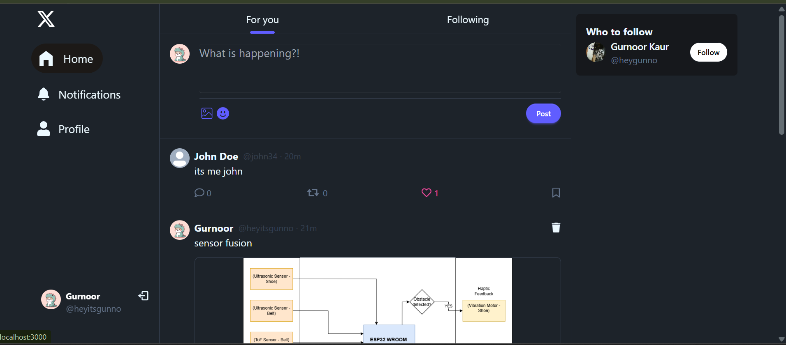

# MERN Stack Twitter Clone 

## 📸 Screenshots  

### Login Page  
  

### Home Page  
  

### Profile Page  
  

### Notifications Page  
  

## 🚀 Overview
This is a full-stack Twitter Clone built using the MERN (MongoDB, Express, React, Node.js) stack. It replicates core Twitter functionalities such as user authentication, posting tweets, liking tweets, following users, and a real-time feed.

## 🛠️ Features
- User authentication (Sign up, Login, Logout)
- Create, read, update, and delete (CRUD) tweets
- Like and unlike tweets
- Follow and unfollow users
- View user profiles with their tweets and follower details
- Real-time updates and interactive UI
- Secure password handling with JWT authentication

## 🏗️ Tech Stack
- **Frontend**: React.js, Redux, Tailwind CSS
- **Backend**: Node.js, Express.js
- **Database**: MongoDB with Mongoose
- **Authentication**: JWT (JSON Web Token)
- **State Management**: Redux Toolkit
- **Storage**: Cloudinary (for media uploads)

## 🎯 Installation & Setup
1. Clone the repository:
   ```sh
   git clone https://github.com/gurnoorkaur-13/twitter-cloned.git
   cd twitter-cloned
   ```

2. Install dependencies for both frontend and backend:
   ```sh
   cd backend
   npm install
   cd ../frontend
   npm install
   ```

3. Set up environment variables: Create a `.env` file in the backend directory and add the following:
   ```sh
   MONGO_URI=your_mongodb_connection_string
   JWT_SECRET=your_jwt_secret_key
   CLOUDINARY_CLOUD_NAME=your_cloudinary_name
   CLOUDINARY_API_KEY=your_cloudinary_api_key
   CLOUDINARY_API_SECRET=your_cloudinary_api_secret
   ```

4. Start the backend server:
   ```sh
   cd backend
   npm start
   ```

5. Start the frontend server:
   ```sh
   cd frontend
   npm start
   ```

6. Open your browser and go to `http://localhost:3000`

## 💡 Future Improvements
- Enhance UI/UX for better user experience
- Optimize database queries for better performance
- Add real-time chat functionality

